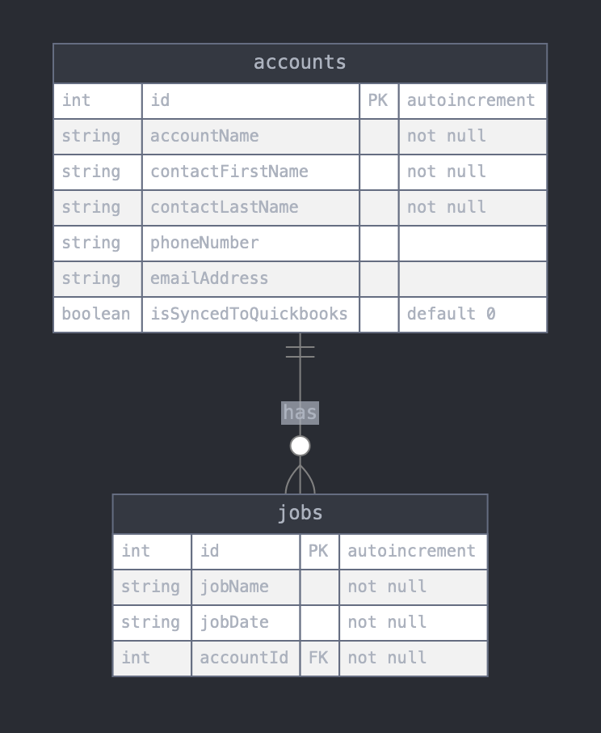

# ByteBounce Tech Support Interview Test

A technical interview test for tech support candidates. The test presents 3 common issues that need to be investigated and resolved.

---

## Getting Started

### Prerequisites
- Node.js 18+
- Git
- Your preferred SQL Client Tool (e.g. DataGrip, DBeaver, Beekeeper Studio, etc.)

---

### Installation

1. Clone this repository `git clone https://github.com/SilasReinagel/TechSupportInterviewTest`
2. Navigate to the project directory `cd TechSupportInterviewTest`

---

### Start The Exercise

1. Run `npm i` to install dependencies
2. Run `npm run mac-reset-dev` (Mac) or `npm run win-reset-dev` (Windows) to reset the database and start the exercise
3. Follow the instructions shown in your browser
  - Fix the issues
  - Feel free to make any changes you'd like to the codebase or the data in the database
  - You are encouraged to talk through your thought process, but it's not required

---

### Database Schema Reference

### Database Location
The SQLite database file is located at `backend/data.sqlite`. The database is automatically created when the application starts, and can be reset using the provided npm scripts.

### Tables

#### accounts
- `id` - INTEGER PRIMARY KEY AUTOINCREMENT
- `accountName` - TEXT NOT NULL
- `contactFirstName` - TEXT NOT NULL
- `contactLastName` - TEXT NOT NULL
- `phoneNumber` - TEXT
- `emailAddress` - TEXT
- `isSyncedToQuickbooks` - BOOLEAN DEFAULT 0

#### jobs
- `id` - INTEGER PRIMARY KEY AUTOINCREMENT
- `jobName` - TEXT NOT NULL
- `jobDate` - TEXT NOT NULL
- `accountId` - INTEGER NOT NULL (Foreign Key -> accounts.id)

